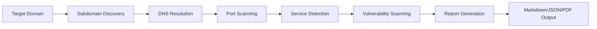

# ReconBot - Automated Reconnaissance & Vulnerability Discovery

**Version:** 2.0  
**Author:** Paul Holder, CC  
**License:** Dual License - Open Source (Personal/Educational) / Commercial License Available

[](https://github.com/paulwfholder/reconbot)
[](https://www.python.org/)
[](#-licensing)

---

## 🎯 What is ReconBot?

**ReconBot** is a modular Python/Bash reconnaissance automation framework that reduces manual security assessment time by **60-80%** through intelligent subdomain enumeration, service detection, and vulnerability scanning workflows.

### Key Features

- 🔍 **Automated Subdomain Discovery** - Integrates multiple OSINT sources (crt.sh, Subfinder, Amass)
- 🌐 **Active Service Enumeration** - Port scanning, technology detection, HTTP header analysis  
- 🛡️ **Vulnerability Assessment** - Integration with Nuclei, Nmap NSE scripts, custom templates
- 📊 **Structured Reporting** - Markdown, JSON, and PDF output formats
- 🔧 **Modular Architecture** - Easy to extend with custom reconnaissance modules
- ⚡ **Performance Optimized** - Concurrent scanning with rate limiting to avoid detection

---

## 🚀 Quick Start

### Prerequisites

```bash
# System requirements
- Python 3.8+
- Bash 4.0+
- 4GB RAM minimum
- Linux/macOS (WSL2 for Windows)

# External tools (auto-installed via setup script)
- subfinder
- nuclei  
- nmap
- jq
```

### Installation

```bash
# Clone repository
git clone https://github.com/paulwfholder/reconbot.git
cd reconbot

# Run automated setup
chmod +x setup.sh
./setup.sh

# Verify installation
./reconbot.sh --version
```

### Basic Usage

```bash
# Single domain reconnaissance
./reconbot.sh -d example.com

# Full scan with vulnerability testing
./reconbot.sh -d example.com --full --output report.md

# Quiet mode with JSON output
./reconbot.sh -d example.com -q --json
```

---

## 📋 Use Cases

### 1. Bug Bounty Hunting
- **Rapid asset discovery** across large attack surfaces
- **Subdomain takeover detection** for quick wins
- **Technology stack fingerprinting** to identify targets

### 2. Security Assessments
- **Client onboarding reconnaissance** for penetration tests
- **Attack surface mapping** for risk assessments  
- **Compliance validation** for external exposure audits

### 3. Continuous Security Monitoring
- **Daily subdomain monitoring** to detect shadow IT
- **Certificate transparency log tracking** for new assets
- **Automated vulnerability baseline** for change detection

### 4. Red Team Operations
- **Initial reconnaissance phase** automation
- **Target profiling** for social engineering
- **Infrastructure enumeration** for attack planning

---

## 🏗️ Architecture

### Modular Design

```
ReconBot
├── modules/
│   ├── subdomain_enum.py      # Passive subdomain discovery
│   ├── port_scanner.py         # Active service detection
│   ├── vuln_scanner.py         # Vulnerability assessment
│   ├── screenshot.py           # Visual reconnaissance
│   └── report_generator.py    # Output formatting
├── config/
│   ├── nuclei_templates/       # Custom vulnerability templates
│   ├── wordlists/              # Enumeration wordlists
│   └── settings.yaml           # Configuration management
├── utils/
│   ├── rate_limiter.py         # Anti-detection measures
│   ├── logger.py               # Audit trail generation
│   └── validators.py           # Input sanitization
└── reconbot.sh                 # Main orchestration script
```

### Workflow



---

## 🔧 Configuration

### Basic Configuration (`config/settings.yaml`)

```yaml
reconnaissance:
  timeout: 300              # Seconds per scan phase
  threads: 10              # Concurrent operations
  rate_limit: 50           # Requests per second
  
subdomain_discovery:
  sources:
    - crt.sh
    - subfinder  
    - amass
  max_depth: 3             # Recursive subdomain levels
  
vulnerability_scanning:
  enabled: true
  severity_threshold: medium  # low/medium/high/critical
  custom_templates: true
  
reporting:
  format: markdown         # markdown/json/pdf
  include_screenshots: true
  redact_sensitive: true
```

### Advanced Features

- **Custom Nuclei Templates** - Add organization-specific vulnerability checks
- **Webhook Integration** - Slack/Discord notifications for findings
- **S3 Export** - Automatic report upload to cloud storage
- **JIRA Integration** - Create tickets for discovered vulnerabilities

---

## 📊 Sample Output

### Terminal Output

```
[*] Starting reconnaissance on example.com
[+] Subdomain Discovery: 47 subdomains found
[+] DNS Resolution: 42 active hosts
[+] Port Scanning: 127 open ports identified
[+] Service Detection: 
    - 23 HTTP/HTTPS services
    - 8 SSH servers  
    - 3 MySQL databases
    - 2 SMTP servers
[!] Vulnerability Scan Results:
    - CRITICAL: 2 findings
    - HIGH: 7 findings  
    - MEDIUM: 15 findings
    - LOW: 23 findings
[*] Report generated: example_com_2025-10-14.md
```

### Markdown Report Structure

```markdown
# Reconnaissance Report - example.com
Generated: 2025-10-14 08:30:00 UTC

## Executive Summary
- 47 subdomains discovered
- 127 open ports identified  
- 47 total vulnerabilities found
- 2 CRITICAL severity issues require immediate attention

## Subdomain Enumeration
| Subdomain | IP Address | Status | Technologies |
|-----------|------------|--------|--------------|
| api.example.com | 192.168.1.10 | Active | Nginx, Node.js |
| admin.example.com | 192.168.1.11 | Active | Apache, PHP 7.4 |

## Vulnerability Findings

### CRITICAL - SQL Injection in Login Form
**Subdomain:** api.example.com/login  
**Severity:** CRITICAL  
**CVSS:** 9.8  
**Description:** Authentication bypass via SQL injection...
**Remediation:** Implement parameterized queries...
```

---

## 🛡️ Security & Ethical Use

### Responsible Disclosure

ReconBot is designed for **authorized security testing only**. Users must:

- ✅ Obtain written permission before scanning any domain
- ✅ Comply with bug bounty program rules and scope
- ✅ Follow responsible disclosure timelines for findings
- ❌ Never use for unauthorized access or malicious purposes
- ❌ Never scan government or military systems without authorization

### Built-in Safeguards

- **Rate limiting** to avoid DoS conditions
- **Scope validation** to prevent accidental out-of-scope scanning  
- **Audit logging** for accountability and compliance
- **Redaction** of sensitive data in reports

---

## 💼 Licensing

### Dual License Concept

ReconBot can be made available under a dual license model:

#### Open Source License (Personal/Educational Use)

**Free for:**
- Individual security researchers
- Educational institutions and students  
- Open source project security testing
- Personal skill development

**Restrictions:**
- No commercial use without license
- Attribution required

#### Commercial License (When Available)

**For organizations requiring:**
- Commercial security consulting use
- Integration into commercial products
- Corporate security team usage

**Contact:** paulwfholder@gmail.com for commercial licensing inquiries.

**Note:** Commercial licensing structure is under development. Pricing will be determined based on organizational needs and scale.

---

## 🤝 Commercial Inquiries

Interested in commercial licensing for your organization?

**Contact:** paulwfholder@gmail.com  
**Subject Line:** "ReconBot Commercial License Inquiry"

Include in your inquiry:
- Organization name and size
- Intended use case
- Estimated scanning volume
- Any specific requirements

Commercial licensing structure is flexible and will be tailored to your organization's needs.

---

## 🔄 Roadmap

### Version 2.1 (Q4 2025)
- [ ] GUI dashboard for report visualization
- [ ] Multi-target batch scanning
- [ ] API endpoint for programmatic access
- [ ] Cloud-native deployment (Docker/Kubernetes)

### Version 3.0 (Q1 2026)  
- [ ] Machine learning for false positive reduction
- [ ] Automated exploit validation
- [ ] Integration with popular pentesting frameworks
- [ ] Mobile app for on-the-go reconnaissance

---

---

## 📞 Support & Community

### Community Support (Open Source License)

- **GitHub Issues** - Bug reports and feature requests
- **Discussions** - Q&A and best practices
- **Wiki** - Documentation and tutorials

### Commercial Support (Paid License)

- **Email** - paulwfholder@gmail.com (24-48 hour response)
- **Slack Channel** - Direct access to development team
- **Video Calls** - Screen-sharing troubleshooting

---

## 🤝 Contributing

Open source contributions welcome! See Issues tab for ways to help.

**Areas to contribute:**
- Bug reports and fixes
- Feature suggestions
- Documentation improvements
- Security testing and feedback

---

## 📄 Legal

### Disclaimer

ReconBot is a security tool intended for authorized testing only. The author assumes no liability for misuse. Users are solely responsible for ensuring legal compliance in their jurisdiction.

### Data Privacy

ReconBot processes security data locally. No reconnaissance data is transmitted to external servers unless explicitly configured by the user (e.g., webhook integrations).

### Export Control

This software may be subject to export control regulations. Users are responsible for compliance with applicable laws.

---

## 📞 Contact

**Paul Holder, CC**  
Application Security Engineer | Tool Developer

- 📧 Email: paulwfholder@gmail.com
- 💼 LinkedIn: [linkedin.com/in/paulwfholder](https://linkedin.com/in/paulwfholder)
- 🐙 GitHub: [github.com/paulwfholder](https://github.com/paulwfholder)  
- 🌐 Portfolio: [paulwfholder.github.io](https://paulwfholder.github.io)

**Commercial Inquiries:** Include "ReconBot Commercial License" in subject line

---

**Last Updated:** October 2025  
**Version:** 2.0  
**Status:** Production Ready

---

*ReconBot - Automating Security Reconnaissance Since 2024*
